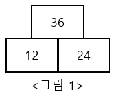
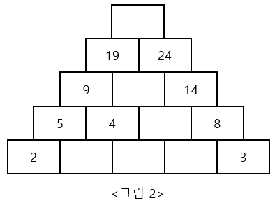

# 블록숫자
## 문제
크기가 일정한 블록들이 놓여 있는데, 제일 아래 층에는 N 개가 나란히 놓여 있고, 그 윗층에는 N-1 개의 블록들이 아래층 블록 사이사이에 놓여 있다. 이런 식으로 블록들이 쌓여 제일 윗층엔 1개의 블록이 놓이게 된다. 각 블록엔 수가 적혀 있는데, <그림 1>에서 보인 것처럼 각 블록엔 자기 바로 아래 있는 블록의 수의 합을 100으로 나눈 나머지가 적혀있다. 단, 제일 아래 층에 있는 블록에 적힌 숫자는 0이상 99이하의 정수이다.

그런데 어떤 이유로 인해, <그림 2>에서 보인 것처럼 상당 수 블록의 숫자가 지워져 보이지 않는다. 그런데 특이한 것은 보이는 수들은 연결되어 있다는 점이다. 지금 보이는 숫자들 만을 이용해서 숫자가 보이지 않는 블록에 적힌 수를 알아내는 프로그램을 작성하시오.

### 입력 형식
가장 아랫층에 있는 블록의 수를 나타내는 정수 N(2 ≤ N ≤ 1,000)이 첫째 줄에 주어진다. 이어지는 N 줄 각각엔 <그림 2>에서 보인 것처럼 피라미드 모양의 위에서부터 아래로 놓인 블록에 적힌 수가 차례로 주어진다. 만약 해당 블록에 숫자가 지워져 보이지 않으면 -1로 표시한다. 위의 규칙을 만족하는 블록들에서 일부에 적혀 있는 내용이 보이지 않는 것이므로, 보이는 숫자들이 모순이 되는 입력은 주어지지 않는다.

### 출력 형식
결과를 N줄에 출력한다. 첫째줄에는 제일 위에 있는 블록에 적힌 수를, 다음 줄에는 그 아래층에 있는 두 블록에 적힌 수를, 이런 식으로 각 층에 있는 모든 블록에 대해, 그 블록에 적힌 수를 한 줄에 출력한다. 만약 해당 블록에 적힌 수를 알 수 없는 경우 -1을 출력하고, 알 수 있는 경우엔 그 값을 100으로 나눈 나머지를 출력한다.

### 입력 예제 1
> 5  
> -1  
> 19 24  
> 9 -1 14  
> 5 4 -1 8  
> 2 -1 -1 -1 3  

### 출력 예제 1
> 43  
> 19 24  
> 9 10 14  
> 5 4 6 8  
> 2 3 1 5 3  

### 입력 예제 2
> 4  
> -1  
> -1 -1  
> -1 3 5  
> -1 -1 2 -1  

### 출력 예제 2
> -1  
> -1 8  
> -1 3 5  
> -1 1 2 3  

### 채점 방식
입력 케이스들은 다음과 같은 종류로 구별되며, 한 종류의 케이스를 다 맞추어야 그 종류에 배정된 점수를 받을 수 있다.

* 종류 1 (10점): 제일 낮은 층의 모든 블록엔 숫자가 적혀 있다.
* 종류 2 (25점) : N ≤ 50
* 종류 3 (55점) : N ≤ 300
* 종류 4 (60점): 별다른 제약조건 없음.

### 제한 사항
|     언어     |  시간 제한   | 메모리 제한  |
|:------------:|:------------:|:------------:|
|       C      |      1초     |    256MB     |
|     C(11)    |      1초     |    256MB     |
|      C++     |      1초     |    256MB     |
|    C++(11)   |      1초     |    256MB     |
|    C++(14)   |      1초     |    256MB     |
|    C++(17)   |      1초     |    256MB     |
|      C#      |      1초     |    256MB     |
|     JAVA     |      1초     |    256MB     |
|    Python2   |      1초     |    256MB     |
|    Python3   |      1초     |    256MB     |

## 풀이
