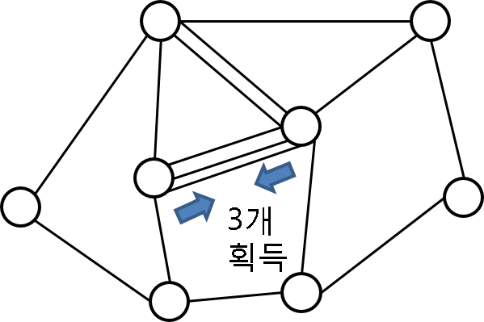

# 금 줄 게임
## 문제
N개의 고무 찰흙 덩어리가 있다. M개의 금 줄이 있어서 각 금 줄은 두개의 서로 다른 고무 찰흙 덩어리를 연결한다.  

게임은 우선 우리 편이 N-2번의 합하기를 지정한다. 각 합하기는 두개의 고무 찰흙 덩어리를 합하는 것이다. 각 합하기에서 합해지는 고무 찰흙 덩어리를 연결하고 있던 금 줄은 우리 편이 획득한다.  

적은 우리 편이 지정한 한번의 합하기가 끝나면 바로, 남아 있는 금 줄 중 하나를 가져간다. 적은 우리 편이 지정한 모든 합하기 과정을 다 알고 있어서 우리 편이 가장 작은 개수의 금 줄을 획득하도록 최선의 선택을 한다. 즉, 적은 우리 편이 지정한 N-2번의 합하기가 순서대로 일어나는 사이 사이에 N-3번의 금 줄 가져가기를 하는 것이다. 적이 금 줄을 가져가지 않을 수도 있다. 특수한 경우로 N=2인 경우는 0개를 획득하는 것으로 바로 게임이 끝나며, 상대방은 아무 것도 하지 않는다.  

우리 편이 획득할 수 있는 가장 많은 금 줄의 개수를 출력하는 프로그램을 작성하라.

### 입력 형식
첫 줄에 고무 찰흙 덩어리의 개수 N과 금 줄의 개수 M이 주어진다. (2 ≤ N ≤ 500, 1 ≤ M ≤ 3,000) 고무 찰흙 덩어리들은 1번 부터 N번 까지 번호가 붙어 있다. 다음 M개의 줄에 각 금 줄이 연결하는 서로 다른 찰흙 덩어리의 번호 쌍이 주어진다. 동일한 쌍을 연결하는 금 줄이 여러 개일 수 있다.

### 출력 형식
우리 편이 획득할 수 있는 가장 많은 금 줄의 개수를 출력한다.

### 입력 예제
> 4 5 
> 1 2  
> 2 1  
> 2 3  
> 4 3  
> 1 4  

### 출력 예제
> 2

### 채점 방식
입력 케이스들은 다음과 같은 종류로 구별되며, 한 종류의 케이스를 다 맞추어야 그 종류에 배정된 점수를 받을 수 있다.  

* 종류 1 (80점): 2 ≤ N ≤ 10, 1 ≤ M ≤ 50.  
* 종류 2 (30점): 한 고무 찰흙 덩어리에서 금 줄을 따라 이동해서 도달할 수 없는 다른 고무 찰흙 덩어리가 있는 경우가 있다.  
* 종류 3 (140점): 추가적 제약조건 없음.  

### 제한 사항
|     언어     |  시간 제한   | 메모리 제한  |
|:------------:|:------------:|:------------:|
|       C      |      2초     |    256MB     |
|     C(11)    |      2초     |    256MB     |
|      C++     |      2초     |    256MB     |
|    C++(11)   |      2초     |    256MB     |
|    C++(14)   |      2초     |    256MB     |
|    C++(17)   |      2초     |    256MB     |
|      C#      |      2초     |    256MB     |
|     JAVA     |      2초     |    256MB     |
|    Python2   |      2초     |    256MB     |
|    Python3   |      2초     |    256MB     |

## 풀이
