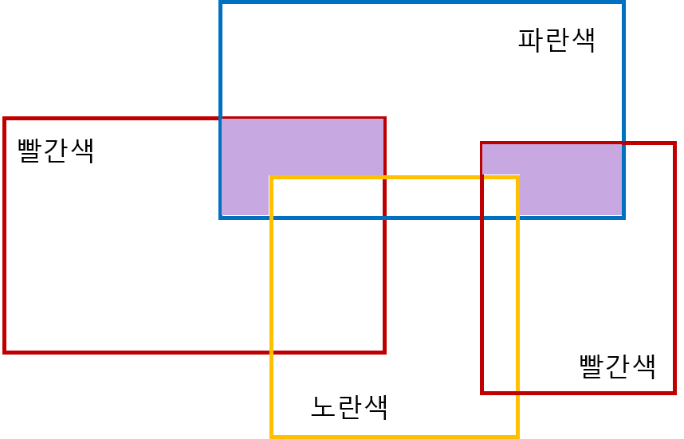

# 보라색 영역
## 문제
하얀 도화지 위(2차원 평면)에 크레파스로 x축과 y축에 평행한 변을 가진 사각형을 그려서 내부를 칠한다. 크래파스는 빨간색, 파란색, 노란색 세 가지 색이 존재한다.

이렇게 그린 N개의 직사각형들이 평면 상에 놓여 있다. 이 때, 보라색 영역의 넓이를 구하고 싶다. 여기서 보라색 영역이란 빨간색 사각형과 파란색 사각형이 겹쳐져 있지만, 노란색 사각형은 겹쳐져 있지 않은 영역이다. 겹쳐져 있는 사각형들의 개수는 중요하지 않다.

아래 그림에서 보라색 부분이 보라색 영역이다.

평면에 그려진 N개의 직사각형들과 칠해진 색깔 정보가 주어질 때, 보라색 영역의 총 면적을 구하는 프로그램을 작성하시오.

### 입력 형식
첫째 줄에 그려지는 직사각형들의 개수를 나타내는 자연수 N(1 ≤ N ≤ 2×105)이 주어진다.

다음 이어지는 N개의 줄 각각에는 하나의 직사각형의 정보를 나타내는 다섯개의 정수 x1, y1, x2, y2, c (0 ≤ x1 < x2 ≤ 109, 0 ≤ y1 < y2 ≤ 109, 1 ≤ c ≤ 3)가 주어진다. 여기서, (x1, y1)는 직사각형의 왼쪽-아래 꼭지점의 좌표이고 (x2, y2)는 직사각형의 오른쪽-위 꼭지점의 좌표이다. 또한 직사각형의 색깔은 c=1이면 빨간색, c=2이면 파란색, c=3이면 노란색을 나타낸다.

### 출력 형식
첫째 줄에 보라색 영역의 총 면적을 출력한다.

### 입력 예제 1
> 4  
> 0 1 3 4 1  
> 4 1 7 4 1  
> 1 2 6 5 2  
> 2 0 5 3 3  

### 출력 예제 1
> 6

### 입력 예제 2
> 3  
> 0 0 2 2 1  
> 1 1 4 2 1  
> 1 1 3 3 2  

### 출력 예제 2
> 2

### 채점 방식
입력 케이스들은 다음과 같은 종류로 구별되며, 한 종류의 케이스를 다 맞추어야 그 종류에 배정된 점수를 받을 수 있다.

* 종류 1 (100점): N ≤ 5,000  
* 종류 2 (100점): 노란색 직사각형은 주어지지 않음.  
* 종류 3 (50점): 별다른 제약조건 없음.  

### 제한 사항
|     언어     |  시간 제한   | 메모리 제한  |
|:------------:|:------------:|:------------:|
|       C      |     2.5초    |    512MB     |
|     C(11)    |     2.5초    |    512MB     |
|      C++     |     2.5초    |    512MB     |
|    C++(11)   |     2.5초    |    512MB     |
|    C++(14)   |     2.5초    |    512MB     |
|    C++(17)   |     2.5초    |    512MB     |
|      C#      |     2.5초    |    512MB     |
|     JAVA     |     2.5초    |    512MB     |
|    Python2   |     2.5초    |    512MB     |
|    Python3   |     2.5초    |    512MB     |

## 풀이
